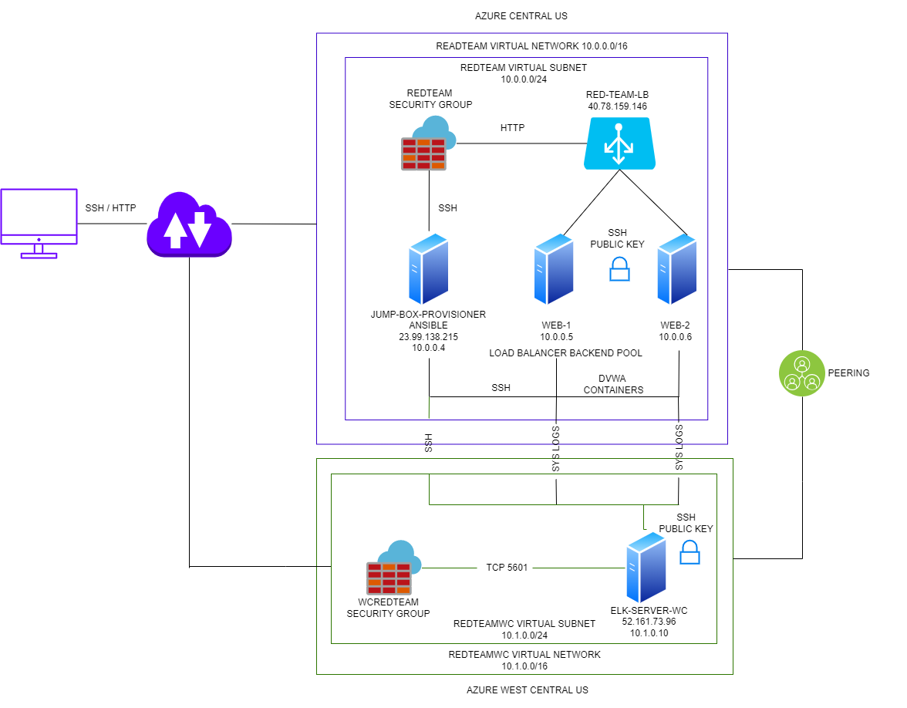
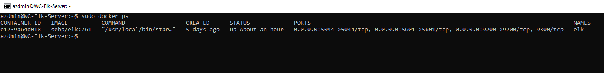

# Automated-ELK-Stack-Deployment
The files in this repository were used to configure the network depicted below.

These files have been tested and used to generate a live ELK deployment on Azure. They can be used to either recreate the entire deployment pictured above. Alternatively, select portions of the YAML file may be used to install only certain pieces of it, such as Filebeat.

- [ansible.cfg](Ansible/ansible.cfg)
- [hosts](Ansible/hosts)
- [install-elk.yml](Ansible/install-elk.yml)
- [filebeat-config.yml](Ansible/filebeat-config.yml)
- [filebeat-playbook.yml](Ansible/filebeat-playbook.yml)
- [metricbeat-config.yml](Ansible/metricbeat-config.yml)
- [metricbeat-playbook.yml](Ansible/metricbeat-playbook.yml)

This document contains the following details:
- Description of the Topology
- Access Policies
- ELK Configuration
  - Beats in Use
  - Machines Being Monitored
- How to Use the Ansible Build

### Description of the Topology

The main purpose of this network is to expose a load-balanced and monitored instance of DVWA, the D*mn Vulnerable Web Application.

Load balancing ensures that the application will be highly efficient, in addition to restricting in-bound access to the network.

*What aspect of security do load balancers protect?*

- Load Balancing plays an important security role as computing moves evermore to the cloud. The off-loading function of a load balancer defends an organization against distributed denial-of-service (DDoS) attacks. It does this by shifting attack traffic from the corporate server to a public cloud provider.

*What is the advantage of a jump box?*

- Load balancing lets you evenly distribute network traffic to prevent failure caused by overloading a particular resource. This strategy improves the performance and availability of applications, websites, databases, and other computing resources. It also helps process user requests quickly and accurately.

**Integrating an ELK server allows users to easily monitor the vulnerable VMs for changes to the data and system logs.**

*What does Filebeat watch for?*

- Installed as an agent on your servers, Filebeat monitors the log files or locations that you specify, collects log events, and forwards them.
	
*What does Metricbeat record?*

- Metricbeat helps you monitor your servers by collecting metrics from the system and services running on the server.

### The configuration details of each machine may be found below.

| Name       | Function                                                                | IP Address | Operating System |
|---------------|-----------------------------------------------------------------|-----------------|------------------|
| Jump Box | Gateway                                                               | 10.0.0.4      | Linux Ubuntu Pro 18.04 |
| Web-1       | Host for container running DVWA                        | 10.0.0.5      | Linux Ubuntu Pro 18.04 |
| Web-2       | Host for container running DVWA                         |  10.0.0.6    | Linux Ubuntu Pro 18.04 |
| Elk-Server | Monitoring and log aggregation for DVWA hosts  |10.1.0.10    | Linux Ubuntu Pro 18.04 |

### Access Policies

The machines on the internal network are not exposed to the public Internet. 

Only the **JumpBox** machine can accept connections from the Internet. 

*Access to this machine is only allowed from the following IP addresses:*
- Home IP Adress

Machines within the network can only be accessed by **JumpBox**.

*Which machine did you allow to access your ELK VM?* 

- My IP Address & JumpBox

*What was its IP address?*

- Home IP & 10.0.0.4

### A summary of the access policies in place can be found in the table below.

| Name     | Publicly Accessible | Allowed IP Addresses |
|----------|------------------------------|----------------------|
| Jump Box | Yes                       | Home IP  |
|  Web-1      | No                        | VM Net             |
|   Web-2     | No                        |  VM Net            |
| Elk-Server | Yes                      | Home IP / 10.0.0.4|

### Elk Configuration

Ansible was used to automate configuration of the ELK machine. No configuration was performed manually, which is advantageous because...

_What is the main advantage of automating configuration with Ansible?_
- This allows you to deploy to multiple servers using a single playbook.

The playbook implements the following tasks:

*In 3-5 bullets, explain the steps of the ELK installation play..*

- Install docker.io
- Install docker pip3
- Install docker container
- Increase virtual memory
- Start & launch a docker container-elk

**The following screenshot displays the result of running `docker ps` after successfully configuring the ELK instance.**

### Target Machines & Beats
*This ELK server is configured to monitor the following machines:*
- Web-1 10.0.0.5 & Web-2 10.0.0.6

*We have installed the following Beats on these machines:*
- `filebeat` is configured to track events from network devices in the syslog and authorization logs for successful / unsuccessful login attempts. 
- `metricbeat` collects system metrics from the web servers, like cpu usage, memory usage, drive space usage and drive space available for each host.

### Using the Playbook
In order to use the playbook, you will need to have an Ansible control node already configured. Assuming you have such a control node provisioned: 

*SSH into the control node and follow the steps below:*
- Copy the **filebeat** file to **/etc/ansible/filebeat-config.yml**.
- Update the **/etc/ansible/hosts** file to include.

  - [elk]

  - 10.1.0.10 ansible_python_interpreter=/usr/bin/python3
- Run the playbook, and navigate to **http://52.161.73.96:5601/app/kibana#/home** to check that the installation worked as expected.

#### Answer the following questions to fill in the blanks

*Which file is the playbook?* 
- filebeat-playbook.yml

*Where do you copy it?*
- /etc/ansible/

*Which file do you update to make Ansible run the playbook on a specific machine?*
- Ansible host file at /etc/ansible/hosts.

*How do I specify which machine to install the ELK server on versus which to install Filebeat on?*
- You identify each machines in the 'hosts' file by their group and IP address.
- You update the 'filebeat-config.yml' to install to IP 10.1.0.10 (Elk-Server).

*Which URL do you navigate to in order to check that the ELK server is running?*
- **http://52.161.73.96:5601/app/kibana#/home**

 
